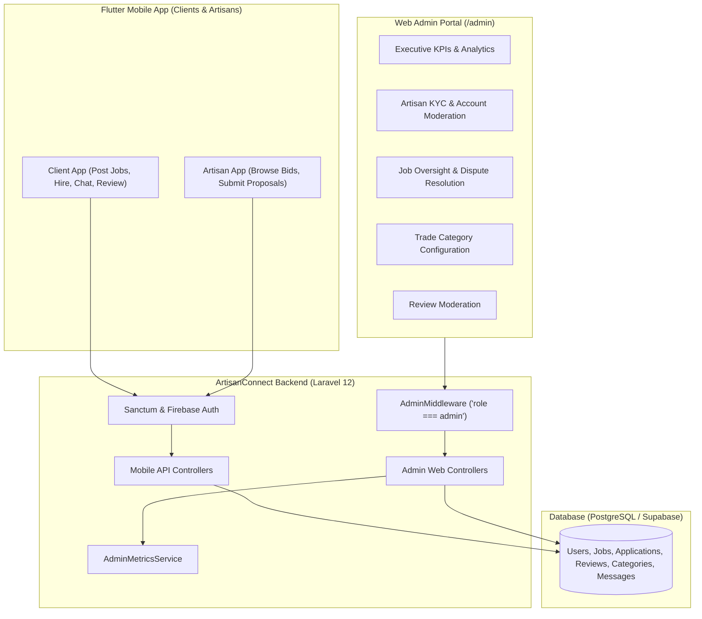

# 🛠️ ArtisanConnect Backend API & Admin Portal

[](https://laravel.com)
[](https://php.net)
[](https://supabase.com)
[](https://phpunit.de)
[](LICENSE)

**ArtisanConnect Backend** powers the ArtisanConnect marketplace platform—connecting clients with certified, local skilled artisans (plumbers, electricians, carpenters, masons, painters, etc.). 

The backend provides a high-performance **REST API** for the Flutter mobile application, real-time messaging, and an integrated **Desktop Web Admin Portal** for platform governance, KYC verification, contract supervision, and business intelligence.

---

## 📑 Table of Contents

- [Key Architecture & Features](#-key-architecture--features)
  - [1. Mobile REST API](#1-mobile-rest-api)
  - [2. Web Admin Dashboard](#2-web-admin-dashboard)
- [Tech Stack](#-tech-stack)
- [System Requirements](#-system-requirements)
- [Installation & Local Setup](#-installation--local-setup)
- [Database Seeding & Default Credentials](#-database-seeding--default-credentials)
- [API Reference](#-api-reference)
- [Running Automated Tests](#-running-automated-tests)
- [Project Directory Structure](#-project-directory-structure)

---

## 🌟 Key Architecture & Features



### 1. Mobile REST API
- **Dual Authentication**: Hybrid authentication supporting email/password (Laravel Sanctum tokens) and Firebase Auth (`/api/auth/firebase-login`).
- **Geo-Location Job Matching**: Haversine distance calculation to filter and match nearby service requests for artisans.
- **Job & Contract Lifecycle**: Posting jobs with attached images, category tagging, budget management, and status progression (`open`, `in_progress`, `completed`, `cancelled`).
- **Proposals & Bidding**: Artisan applications with custom proposals, bid statuses (`pending`, `accepted`, `rejected`).
- **Ratings & Reviews**: 1-to-5 star rating and feedback system for completed contracts.
- **In-App Messaging**: Real-time communication between clients and artisans with conversation threading.

### 2. Web Admin Dashboard (`/admin`)
- **Executive Overview**: Real-time platform KPI cards, 6-month growth trends (Chart.js), trade category distribution, and live event feeds.
- **Artisan KYC & Verification**: Dedicated queue to review unverified artisans, inspect credentials, approve/reject verification status, and log review notes.
- **Account Moderation**: Fast suspend / activate controls for user management.
- **Contract & Dispute Management**: Search and filter contracts, view artisan bids, and perform manual status overrides to resolve client-artisan disputes.
- **Trade Category Management**: Add and customize service categories with Flutter icon names and theme colors.
- **Review Moderation**: Star breakdown analytics and toxic review removal.
- **Admin REST APIs**: Guarded `/api/admin/*` endpoints for administrative mobile views.

---

## 💻 Tech Stack

- **Framework**: [Laravel 12.x](https://laravel.com)
- **Language**: [PHP 8.3+](https://php.net)
- **Database**: [PostgreSQL (Supabase)](https://supabase.com) (production/dev) / SQLite in-memory (automated tests)
- **Authentication**: [Laravel Sanctum](https://laravel.com/docs/sanctum) & [Firebase Admin SDK](https://github.com/kreait/laravel-firebase)
- **Frontend / Admin Styling**: [Tailwind CSS](https://tailwindcss.com), [Chart.js](https://www.chartjs.org), Google Fonts (Plus Jakarta Sans & Work Sans)
- **Testing**: [PHPUnit 12.x](https://phpunit.de)

---

## 📋 System Requirements

- **PHP**: `^8.3` with extensions: `pdo`, `pdo_pgsql`, `pdo_sqlite`, `openssl`, `mbstring`, `tokenizer`, `xml`, `ctype`, `json`, `curl`
- **Composer**: `^2.5`
- **Node.js**: `^20.x` & `npm` (optional, for asset compiling with Vite)
- **Database**: PostgreSQL (or local SQLite)

---

## 🚀 Installation & Local Setup

### 1. Clone the Repository
```bash
git clone https://github.com/Mayami65/ArtisanConnect-Backend.git
cd ArtisanConnect-Backend
```

### 2. Install PHP Dependencies
```bash
composer install
```

### 3. Environment Configuration
Copy the sample environment file and generate the application key:
```bash
cp .env.example .env
php artisan key:generate
```

Configure your `.env` database connection:
```env
DB_CONNECTION=pgsql
DB_HOST=aws-0-eu-central-1.pooler.supabase.com
DB_PORT=5432
DB_DATABASE=postgres
DB_USERNAME=your_username
DB_PASSWORD=your_password
```

### 4. Run Database Migrations
Run the database migrations:
```bash
php artisan migrate
```

### 5. Start the Development Server
```bash
php artisan serve
```
The server will start at **`http://127.0.0.1:8000`**.

---

## 🔑 Database Seeding & Default Credentials

Seed standard categories, sample clients, verified/unverified artisans, and the default administrator:

```bash
php artisan db:seed
```

### Default Login Accounts:

| Role | Email | Password | Access Surface |
| :--- | :--- | :--- | :--- |
| **Super Admin** | `admin@artisanconnect.com` | `password` | Web Admin (`/admin/login`) & API |
| **Client** | `alice@example.com` | `password` | Mobile App / API |
| **Artisan (Verified)** | `kwame@example.com` | `password` | Mobile App / API |
| **Artisan (Unverified)** | `ama@example.com` | `password` | Verification Queue (`/admin/users`) |

---

## 📡 API Reference

### Public & Authentication Routes
| Method | Endpoint | Description |
| :--- | :--- | :--- |
| `POST` | `/api/auth/register/client` | Register new client account |
| `POST` | `/api/auth/register/artisan` | Register new artisan with trade & hourly rate |
| `POST` | `/api/auth/login` | Login with email and password |
| `POST` | `/api/auth/firebase-login` | Authenticate with Firebase ID token |
| `GET` | `/api/categories` | List all service categories |
| `GET` | `/api/jobs` | Browse active/nearby jobs (supports `lat`, `lng`) |
| `GET` | `/api/reviews/artisan/{id}` | Get reviews and ratings for an artisan |

### Authenticated Client & Artisan Routes (`auth:sanctum`)
| Method | Endpoint | Description |
| :--- | :--- | :--- |
| `GET` | `/api/user` | Get current authenticated user profile |
| `PATCH` | `/api/user` | Update user profile, bio, or coordinates |
| `GET` | `/api/my-jobs` | Get jobs posted by client / applied by artisan |
| `POST` | `/api/jobs` | Post a new service request |
| `GET` | `/api/jobs/{id}` | Get detailed service job info |
| `PATCH` | `/api/jobs/{id}/status` | Update job lifecycle status |
| `POST` | `/api/jobs/{id}/apply` | Artisan submits proposal to a job |
| `POST` | `/api/jobs/{id}/reviews`| Client submits review and rating |
| `GET` | `/api/messages/conversations` | Get active chat conversations |
| `GET` | `/api/messages/{user}` | Get chat message history with user |
| `POST` | `/api/messages/{user}` | Send chat message to user |

### Admin Routes (`auth:sanctum` + `admin`)
| Method | Endpoint | Description |
| :--- | :--- | :--- |
| `GET` | `/api/admin/dashboard` | High-level KPIs, 6-month trends, activity feed |
| `GET` | `/api/admin/users` | List users with search, role, and verification filters |
| `POST` | `/api/admin/users/{user}/verify` | Approve or revoke artisan KYC verification |
| `POST` | `/api/admin/users/{user}/toggle-active` | Suspend or activate user account |
| `GET` | `/api/admin/jobs` | Filter and monitor all service jobs |
| `PATCH`| `/api/admin/jobs/{job}/status` | Manually override job status for dispute resolution |

---

## 🧪 Running Automated Tests

ArtisanConnect Backend includes a complete PHPUnit feature test suite covering authentication, admin authorization, KYC verification workflows, job status management, and category CRUD.

To run tests:
```bash
php .\vendor\bin\phpunit
```

To run only the administrative test suite:
```bash
php .\vendor\bin\phpunit --filter=Admin
```

---

## 📂 Project Directory Structure

```text
ArtisanConnect-Backend/
├── app/
│   ├── Http/
│   │   ├── Controllers/
│   │   │   ├── Admin/                  # Admin Web & API Controllers
│   │   │   │   ├── AdminAuthController.php
│   │   │   │   ├── AdminCategoryController.php
│   │   │   │   ├── AdminDashboardController.php
│   │   │   │   ├── AdminJobController.php
│   │   │   │   ├── AdminReviewController.php
│   │   │   │   └── AdminUserController.php
│   │   │   ├── AuthController.php      # Mobile Client/Artisan Auth
│   │   │   ├── ServiceJobController.php
│   │   │   ├── ApplicationController.php
│   │   │   ├── ChatController.php
│   │   │   └── ReviewController.php
│   │   └── Middleware/
│   │       └── AdminMiddleware.php     # Role-based Administrator Guard
│   ├── Models/
│   │   ├── User.php
│   │   ├── ServiceJob.php
│   │   ├── Application.php
│   │   ├── Category.php
│   │   ├── Review.php
│   │   └── Message.php
│   └── Services/
│       └── Admin/
│           └── AdminMetricsService.php # Business metrics & Chart analytics
├── database/
│   ├── migrations/                     # Schema migrations
│   └── seeders/                        # Database seeders
├── resources/
│   └── views/
│       ├── layouts/
│       │   └── admin.blade.php         # Master administrative layout
│       └── admin/                      # Admin Blade templates
│           ├── auth/login.blade.php
│           ├── dashboard.blade.php
│           ├── users/
│           ├── jobs/
│           ├── categories/
│           └── reviews/
├── routes/
│   ├── api.php                         # REST API endpoints
│   └── web.php                         # Web admin portal routes
└── tests/
    └── Feature/
        ├── AdminAuthTest.php           # Admin authentication tests
        └── AdminManagementTest.php     # Management & KYC verification tests
```

---

## 📄 License

This software is open-sourced under the [MIT license](LICENSE).
