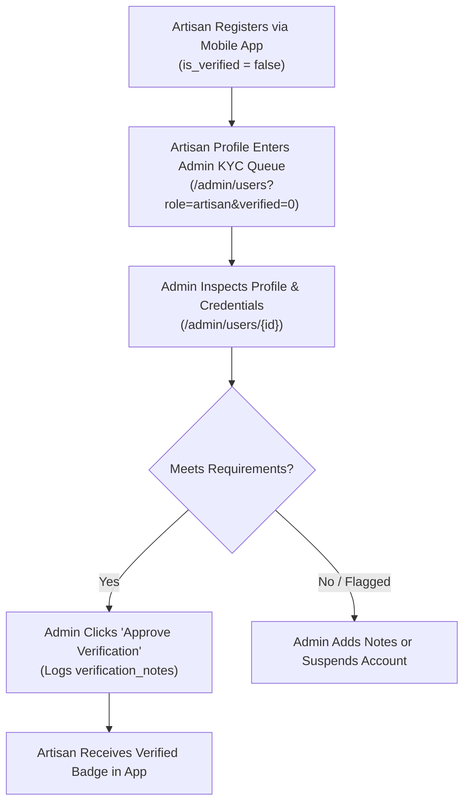

# 🛡️ Admin Operations & Governance Handbook

This operational manual guides platform administrators through the features, workflows, and moderation tools available within the **ArtisanConnect Web Admin Portal** (`http://localhost:8000/admin`).

---

## 1. Accessing the Admin Portal

- **URL**: `/admin/login`
- **Security Check**: Requires an active user account with `role = 'admin'`.
- **Default Super Admin**:
  - **Email**: `admin@artisanconnect.com`
  - **Password**: `password`

Upon authenticating, administrators are automatically directed to the **Executive Dashboard**. Non-admin users attempting to log in receive an *Access Denied* error and their session is terminated immediately.

---

## 2. Executive Dashboard (`/admin/dashboard`)

The dashboard aggregates high-priority platform metrics:

### Key Metrics:
1. **Total Users**: Total platform membership, including sub-breakdown of clients and artisans.
2. **Service Jobs**: Volume of service requests across open, in-progress, and completed states.
3. **Marketplace Volume**: Cumulative GHS budget sum of all posted jobs.
4. **Verification Queue**: Current count of artisans awaiting KYC verification with quick action badge.

### Visual Analytics:
- **6-Month Volume Trends**: Multi-series bar chart plotting jobs posted vs. user registrations month-over-month.
- **Category Distribution**: Doughnut chart breaking down service requests by trade.

### Live Feeds:
- **Pending Artisan Verifications List**: Top 5 artisans pending review with one-click approval buttons.
- **Recent Platform Activity**: Chronological feed of user registrations, new job submissions, and submitted client reviews.

---

## 3. Artisan KYC Verification Workflow

ArtisanConnect enforces high trust standards. Artisans must be verified to build client confidence.

### Steps to Verify an Artisan:
1. Navigate to **Users & Artisans** $\to$ click the **Pending KYC** tab.
2. Click **View** on the artisan's row to open their profile.
3. Review their bio, trade category, contact phone number, and location.
4. Click **Approve Verification**. The artisan is immediately granted the verified checkmark across the mobile platform.
5. If necessary, verification can be revoked at any time by clicking **Revoke Verification**.

---

## 4. User Moderation & Suspension

If an account is flagged for scamming, abusive behavior, or non-compliance:
1. Open the user's profile at `/admin/users/{id}`.
2. Click **Suspend Account**.
3. Suspended accounts are immediately blocked from logging in or using the mobile API (`is_active = false`).
4. Accounts can be restored at any time by clicking **Activate Account**.

> [!NOTE]
> Administrators cannot suspend their own admin account.

---

## 5. Job Contracts & Dispute Resolution (`/admin/jobs`)

When clients and artisans encounter disagreements regarding scope, payments, or completion:

1. Open **Service Jobs** and locate the job via search or status filter.
2. Click **Manage** to inspect the job detail view:
   - Client contact info and initial description.
   - All artisan proposals and bids.
   - Attached site photos.
   - Client reviews (if any).
3. **Status & Dispute Override**:
   Under the *Status & Dispute Override* card, administrators can manually change the status:
   - `open`: Re-opens the job so other artisans can submit bids.
   - `in_progress`: Confirms contract is actively underway.
   - `completed`: Forces completion.
   - `cancelled`: Terminates the contract.

---

## 6. Trade Category Configuration (`/admin/categories`)

Administrators can introduce new service categories as the platform expands:

1. Navigate to **Categories**.
2. Fill in the **Add New Trade Category** form:
   - **Category Name**: e.g., `Roofing & Guttering`
   - **Flutter Icon Identifier**: Name of the Material icon used in the Flutter app (e.g. `roofing`, `plumbing`, `handyman`, `construction`, `electrical_services`).
   - **Color Hex**: Brand color accent in `#RRGGBB` format (with visual color picker).
3. Click **Create Category**. The new trade immediately appears in the mobile category catalog.

---

## 7. Review Moderation (`/admin/reviews`)

To maintain fair and authentic feedback:
1. Navigate to **Reviews & Moderation**.
2. Inspect ratings breakdown (1 to 5 stars) and search comments for inappropriate language.
3. To delete a fraudulent, abusive, or spam review, click **Delete** next to the record. Deleting a review automatically recalculates the artisan's average rating.
