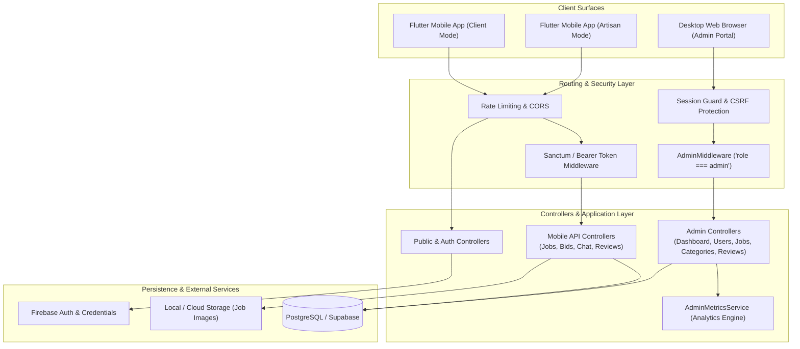
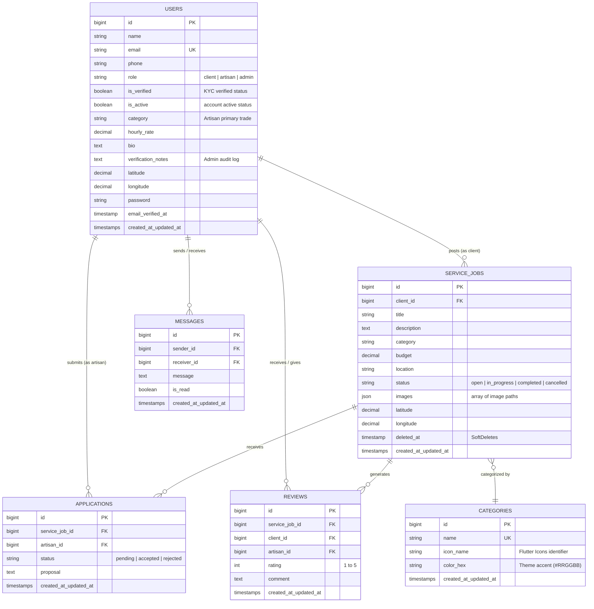

# 🏛️ System Architecture & Design

This document details the software architecture, data modeling, authentication lifecycle, and technical decisions underpinning the **ArtisanConnect Backend**.

---

## 1. High-Level Architecture

ArtisanConnect is structured as a **modular monolith** serving two distinct client interfaces:
1. **Flutter Mobile Application**: Consumes JSON REST APIs over HTTPS, authenticated via personal access tokens (`Bearer` via Laravel Sanctum) or Firebase Auth tokens.
2. **Platform Web Admin Portal**: Server-rendered Laravel Blade interface styled with Tailwind CSS and Chart.js, secured by session-based authentication and role-checking middleware.

---

## 2. Entity-Relationship (ER) Diagram

---

## 3. Authentication & Authorization Lifecycles

### A. Mobile Client Authentication
- **Sanctum Token Authentication**: Standard register/login endpoints return an API Bearer token (`auth_token`). The Flutter application includes this header: `Authorization: Bearer <token>`.
- **Firebase Authentication Exchange**: Artisans or clients who sign in via Google/Apple Auth in Flutter send their Firebase ID token to `POST /api/auth/firebase-login`. The backend verifies the token with the Firebase Admin SDK and issues a Sanctum personal access token.

### B. Administrator Authorization
- All `/admin/*` routes are protected by `App\Http\Middleware\AdminMiddleware`.
- The middleware enforces:
  1. User must be authenticated (`Auth::check()`).
  2. User must possess role `admin` (`$user->role === 'admin'`).
  3. User must not be deactivated (`$user->is_active === true`).
- Unauthorized web visits are redirected to `/admin/login` with flash error messages. API calls return `403 Forbidden`.

---

## 4. Geospatial Matching Engine (Haversine Formula)

When clients or artisans browse jobs with latitude and longitude query parameters (`/api/jobs?lat=5.6037&lng=-0.1870`), the backend computes the exact spherical distance between the user's coordinates and the job's coordinates using the **Haversine formula**:

$$\Delta\sigma = 2 \arcsin \sqrt{\sin^2\left(\frac{\Delta\phi}{2}\right) + \cos\phi_1 \cos\phi_2 \sin^2\left(\frac{\Delta\lambda}{2}\right)}$$

$$d = R \cdot \Delta\sigma \quad (R = 6,371\text{ km})$$

This calculation is implemented in `ServiceJobController.php` and dynamically attaches a `distance_in_km` attribute to each job, sorting the results ascending so users see the closest jobs first.

---

## 5. Soft Deletes & Data Integrity

Service jobs implement `Illuminate\Database\Eloquent\SoftDeletes`. When a job is cancelled or removed by a client, the record is soft-deleted (`deleted_at` timestamp populated), preserving historical audit trails, accounting records, and associated reviews.
