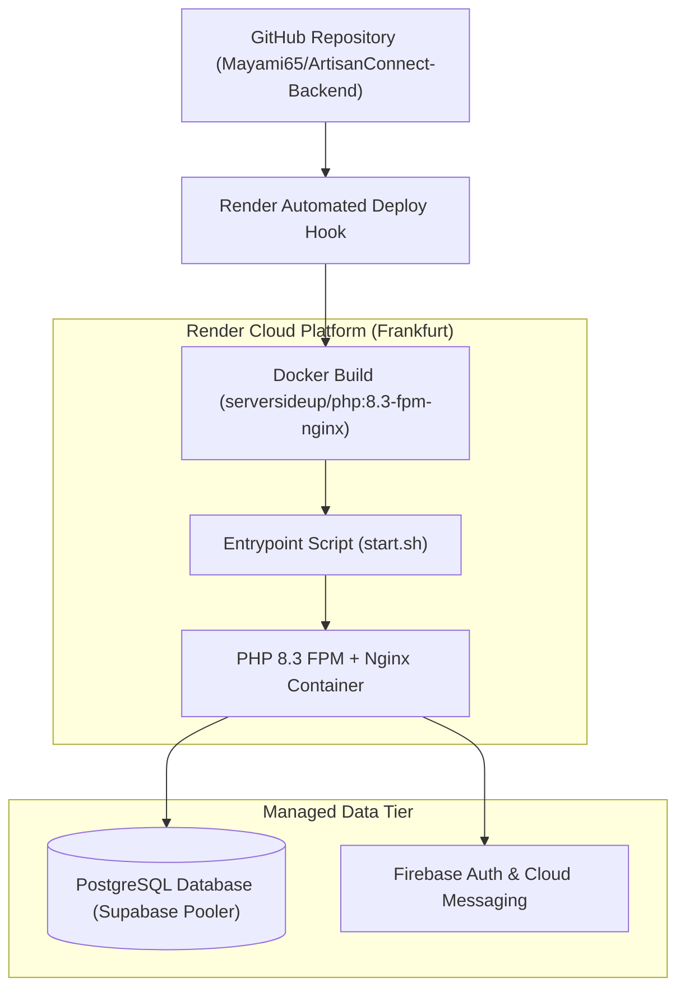

# 🚀 Deployment & DevOps Operations Guide

This guide covers deployment pipelines, Docker containerization, cloud hosting on Render, Supabase PostgreSQL configuration, and day-to-day operations for **ArtisanConnect Backend**.

---

## 1. Hosting Architecture Overview



---

## 2. Docker Architecture

The backend utilizes `serversideup/php:8.3-fpm-nginx`, an enterprise-grade base image pairing PHP 8.3 FPM with Nginx in a single lightweight container.

### Highlights of `Dockerfile`:
- Pre-configured Nginx optimized for Laravel URL rewrites.
- Non-root `www-data` execution for security compliance.
- Installs `postgresql-client` for native PostgreSQL connectivity.
- Executes `start.sh` on startup as a drop-in entrypoint script.

### Local Docker Build & Test:
```bash
# Build container image
docker build -t artisanconnect-backend .

# Run container locally on port 8080
docker run -p 8080:8080 --env-file .env artisanconnect-backend
```

---

## 3. Render Deployment (`render.yaml`)

ArtisanConnect includes an Infrastructure-as-Code (IaC) blueprint in `render.yaml`.

### Automated Deployment Flow:
1. Connect the GitHub repository to [Render Dashboard](https://dashboard.render.com).
2. Select **Blueprints** $\to$ connect repo $\to$ Render detects `render.yaml`.
3. Set the secret environment variable `FIREBASE_CREDENTIALS_JSON` in the Render dashboard (raw JSON content of your Firebase service account key).
4. Render automatically builds the Docker image and triggers `start.sh`.

### `start.sh` Startup Sequence:
```bash
#!/usr/bin/env bash
set -e

# 1. Reconstitute Firebase service account credentials
if [ ! -z "$FIREBASE_CREDENTIALS_JSON" ]; then
    echo "$FIREBASE_CREDENTIALS_JSON" > /var/www/html/firebase-credentials.json
fi

# 2. Compile runtime cache & run schema migrations
php artisan config:cache
php artisan route:cache
php artisan view:cache
php artisan migrate --force
php artisan db:seed --class=CategorySeeder --force
```

---

## 4. PostgreSQL Database (Supabase)

ArtisanConnect uses PostgreSQL hosted on Supabase in the EU (Frankfurt) region:
- **Pooler Host**: `aws-0-eu-central-1.pooler.supabase.com`
- **Port**: `5432` (Session Pooler) or `6543` (Transaction Pooler)
- **Database**: `postgres`

### Production `.env` Database Configuration:
```env
DB_CONNECTION=pgsql
DB_HOST=aws-0-eu-central-1.pooler.supabase.com
DB_PORT=5432
DB_DATABASE=postgres
DB_USERNAME=postgres.your_project_ref
DB_PASSWORD=your_secure_password
DB_SSLMODE=prefer
```

---

## 5. Firebase Setup & Service Account

1. Open the [Firebase Console](https://console.firebase.google.com).
2. Navigate to **Project Settings** $\to$ **Service Accounts**.
3. Click **Generate New Private Key**.
4. Rename downloaded file to `firebase-credentials.json` (for local development).
5. For cloud deployments, copy the JSON string into the `FIREBASE_CREDENTIALS_JSON` environment variable.

---

## 6. Production Maintenance & CLI Commands

### Run Migrations in Production:
```bash
php artisan migrate --force
```

### Seed Platform Admin User in Production:
```bash
php artisan db:seed --class=UserSeeder --force
```

### Clear and Rebuild Runtime Cache:
```bash
php artisan optimize:clear
php artisan config:cache
php artisan route:cache
php artisan view:cache
```

### Storage Symlink Creation:
Ensure public uploads are accessible:
```bash
php artisan storage:link
```

### Running Background Queue Worker:
```bash
php artisan queue:work database --sleep=3 --tries=3 --max-time=3600
```

---

## 7. Health Check & Uptime Monitoring

ArtisanConnect exposes a native health-check endpoint:
- **Endpoint**: `GET /up`
- **Expected Status**: `200 OK`
- Use this URL for uptime monitors (e.g. UptimeRobot, BetterStack, or Render Health Check).
